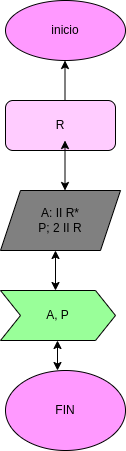

# AreaPerimetroCirculo
programa para calcular el área y perímetro de un circulo en radio R

## calcular el area y el perimetro de un circulo

# analisis

variables de entrada 

R: Radio del circulo
P: perimetro del circulo

# Diseño

# CONSTRUCCION

## ESTE ARCHIVO ESTA ESCRITO EN LENGUAJE MARKDOWN 

